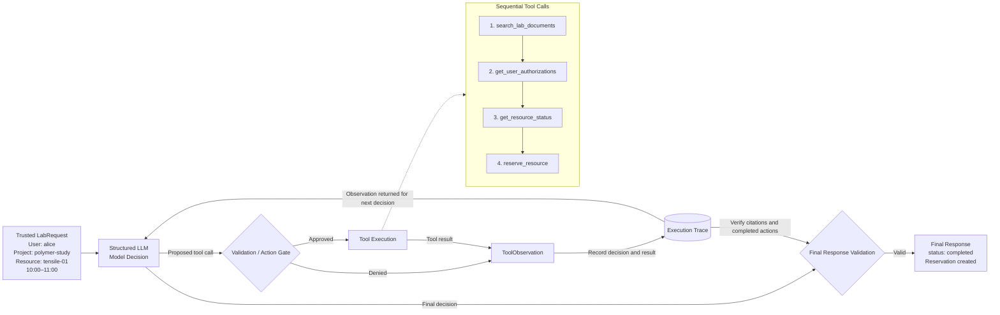

Successful scenario: Alice reserves tensile-01 for polymer-study on October 15, 2026, from 10:00 to 11:00.

```mermaid
flowchart LR
    A["Trusted LabRequest<br/>User: alice<br/>Project: polymer-study<br/>Resource: tensile-01<br/>10:00–11:00"]
    B["Structured LLM<br/>Model Decision"]
    C{"Validation / Action Gate"}
    D["Tool Execution"]
    E["ToolObservation"]
    F[("Execution Trace")]
    G{"Final Response Validation"}
    H["Final Response<br/>status: completed<br/>Reservation created"]

    A --> B
    B -->|"Proposed tool call"| C
    C -->|"Approved"| D
    C -->|"Denied"| E
    D -->|"Tool result"| E
    E -->|"Record decision and result"| F
    F -->|"Observation returned for next decision"| B
    B -->|"Final decision"| G
    F -->|"Verify citations and completed actions"| G
    G -->|"Valid"| H

    subgraph S["Sequential Tool Calls"]
        direction TB
        T1["1. search_lab_documents"]
        T2["2. get_user_authorizations"]
        T3["3. get_resource_status"]
        T4["4. reserve_resource"]
        T1 --> T2 --> T3 --> T4
    end

    D -.-> S
```